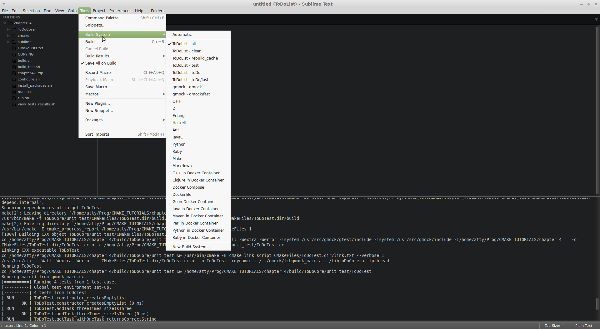

# CMake_Tutorial

Lien vers la page tutorial: [https://www.johnlamp.net/cmake-tutorial.html](https://www.johnlamp.net/cmake-tutorial.html)

Super tutorial, très complet, bien expliqué!

Pour la génération des projets, j'ai utilisé dans le chapter_4 (en particulier) une target spécifique pour Sublime: `cmake -G "Sublime Text 2 - Unix Makefiles" ..` (voir dans [configure.sh](chapter_4/configure.sh))

Ca permet de générer (dans le répertoire) `build` un fichier `ToDoList.sublime-project` qui contient des `Build System` (sublime) pour le projet `ToDoList`:

